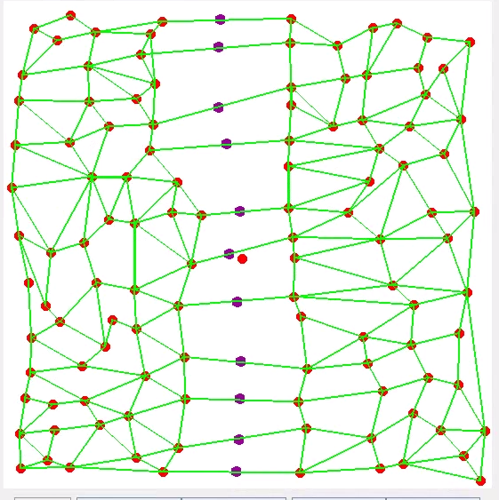
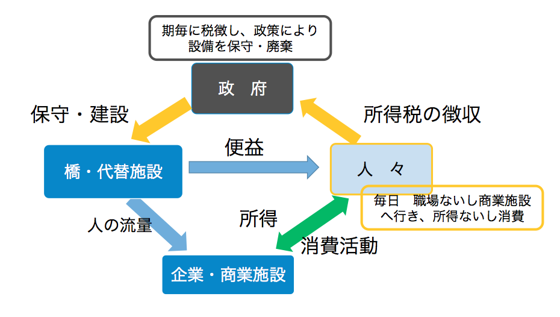
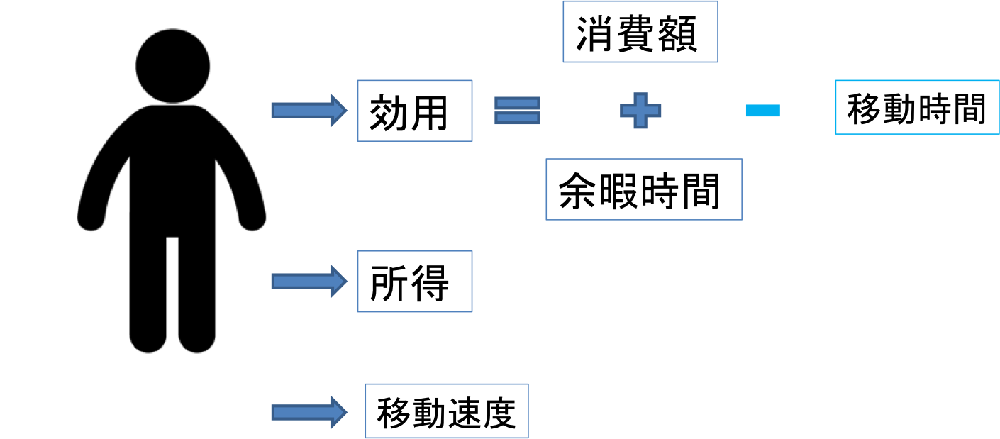
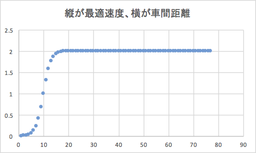
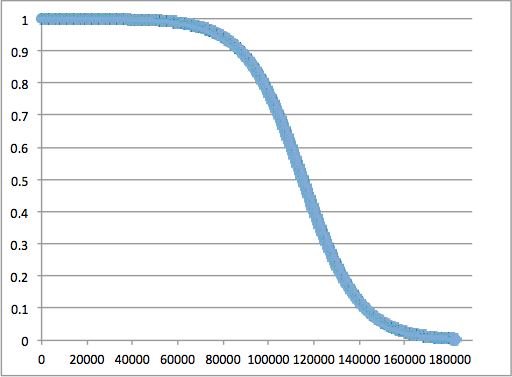
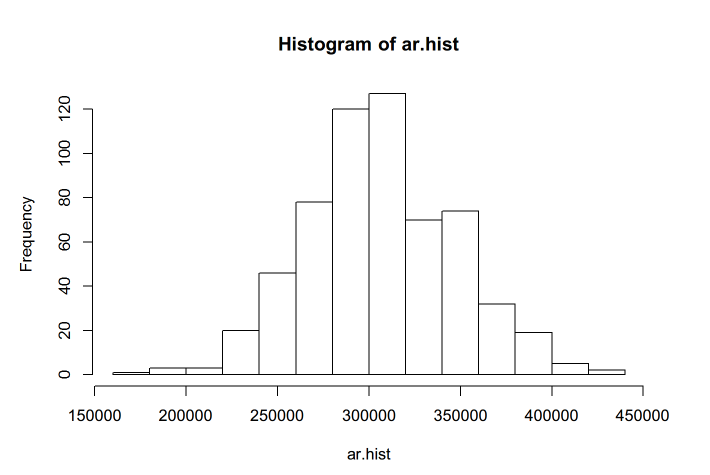
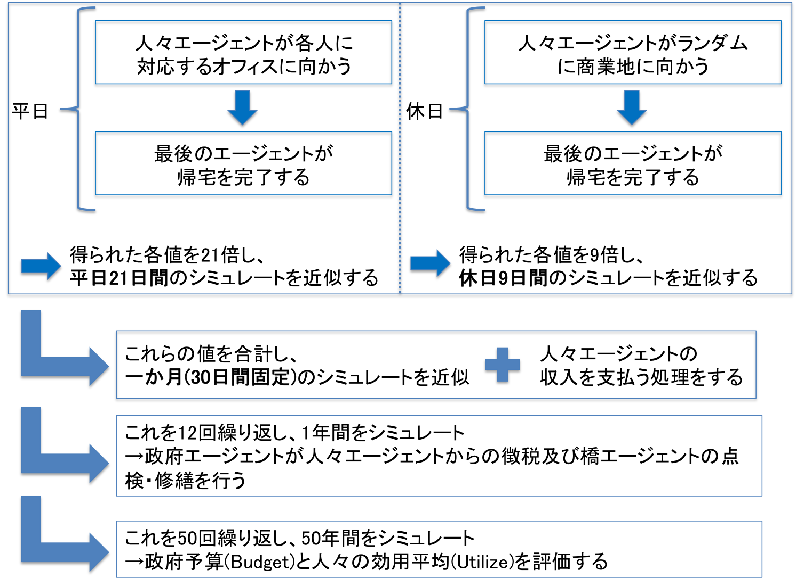
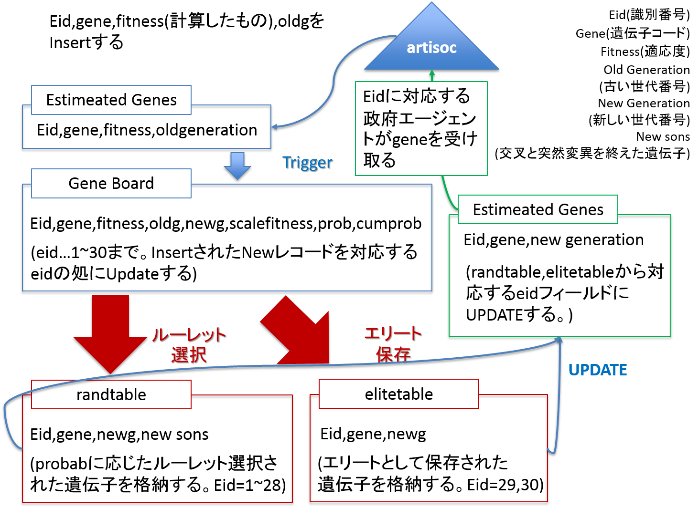

経済的需要を重視した橋梁管理手法の有効性に関するマルチエージェントシミュレーション分析
===========================================

Yusuke Fukasawa

# 要旨

アブストラクト

# 1. 序論

この項では本研究の前提となる二つの事象及び目的を説明する。

第一の前提は、我が国における橋梁の老朽化の現状である。現在の橋梁は1960年代の高度経済成長期に建設されたものが多く、もうすぐ構造寿命である50年を迎える橋梁が頻出する。その管理手法について十分に検討を行う必要性がある。

第二の前提は、我が国が橋梁修繕に対して割ける予算の現状である。生産年齢人口が今後更に減少していく見通しがほぼ確実とされている中、現状においても満足に橋梁の修繕が完了していない状況を踏まえれば、今後も十分な予算が割り当てられるとは考えにくいであろう。橋梁の修繕は喫緊の課題であることは第一の前提により明白とされているものの、厳しい予算制約が存在することを考慮した上で修繕計画を実施していく必要がある。

以上の前提を踏まえ、本研究では厳しい予算制約がある中で最も効果を発揮する橋梁の管理手法の最適化を目的とする。その目的を達成するために、マルチエージェントシミュレーションによる経済実験を行う。

# 2. 先行研究

この項では先行研究の概観を行う。本研究に関連する先行研究は大きく分けて3つのカテゴリに分類されると考えられる。

# 2-1. 橋梁のライフサイクルコスト最小化に関する研究群

# 2-2. 橋梁の管理計画最適化に関する研究群

# 2-3. 橋梁の価値を測定する研究群

# 3. 本研究で用いる手法

本研究のアプローチは大きく分けて二つの手法によって構成されている。一つがマルチエージェントシミュレーション、そしてもう一つがそのシミュレーション内で行う遺伝的アルゴリズムである。以下、両者について簡単に説明を行う。

# 3-1. マルチエージェントシミュレーション

本研究ではマルチエージェントシミュレーションというシミュレーション手法をとる。

# 3-2. 遺伝的アルゴリズム

後述するが、本研究ではエージェントに学習を行わせることで最適化を図る。その際に導入する遺伝的アルゴリズムについて簡単に説明を行う。

# 4. シミュレーションモデルに関する説明

本項ではマルチエージェントシミュレーションを行うモデルについて説明を行う。

# 4-1. シミュレーションの全体像

本モデルは人々エージェント・橋エージェント・政府エージェントという三つの主要なエージェントの行動によって構成される。モデルの中心には一本の川が引かれており、右側には住宅地・左側にはオフィスや商業地があるという社会を想定している。人々は毎日右側の住宅地域から左側の商業地域で消費活動や勤労活動などの経済活動を行うために川を渡らなければならない。川には11本の橋が引かれており、人々は川を渡るために橋を用いなければならず、橋がこの社会の中の経済活動の中心点となっている。

人々エージェントは住居エリアから橋を渡り、企業及び商業施設が存在する向こう岸へと行って労働活動か消費行動という何らかの経済活動を行った後、帰宅するという行動を繰り返している。図2の緑色の矢印がこれにあたる。

この人々の経済活動を支えるのが橋エージェントである。橋エージェントは人々及び企業・商業施設が経済活動を行うことを可能にするエージェントである。図2の青色の矢印がこれにあたる。

人々エージェント・橋エージェントに対して政府エージェントは両エージェントに対して働きかける行動を行う。人々エージェントに対しては1年が経過するごとに事前に決められたルールに基づいて所得税を徴収し、それを政府予算とする。そしてその予算を用いて橋の点検・修繕という橋梁管理計画を実行する。図2の黄色の矢印がこれにあたる。

# 4-2. 人々エージェントについて

続いてシミュレーションを構成する各エージェントについて更に詳しく説明する。まず、人々エージェントについてである。

人々エージェントを構成するパラメータとして主要なものは効用と所得、そして移動速度である。

## 4-2-1. 人々エージェントの行動フロー

まず人々エージェントの行動フローに関して説明を行う。本モデルはネットワーク形式によって表現されており、右端に人々エージェントの住居が、左端にオフィス・商業地が存在する。各エージェントはダイクストラ法によって目的地への最短距離を算出し、そのルートを通って目的地へと向かう。帰宅時も同様にダイクストラ法によって算出された最短ルートで家に帰っていく。また本モデルでは、全人々エージェントの行動が終了、つまり全員が何らかの経済活動を行い、最後のエージェントが帰宅した時点で1日が経過するものとする。

## 4-2-2. 人々エージェントの移動

またこれら人々エージェントは週休二日制で働くという仮定を置いている。

本モデルにおいて人々エージェントは移動する際に可変的な移動速度に基づいて移動を行う。移動速度の算出式はOptimal Velocity Modelを用いて以下のように表現した。 (Bando et al. 1994)

**Equation 1:**最高速度モデル-1

Xn、Vnがn番目のエージェントの位置及び速度を表す。aは感応度であり各エージェントの反射神経に当たるパラメータである。このモデルにおいてエージェントの移動速度は前方のエージェントとの距離に応じて決定される。それに対して基準となるのが最高速度であり、現在の速度が最高速度より早ければブレーキをかけ、逆に遅ければ加速する。最高速度は次の式で定義される。Vmaxは基準最高速度、Xcは標準距離、αは減速係数である。

**Equation 2:**最高速度モデル-2

今回のモデルでは各種パラメータを次のように設定している。

| パラメータ名       | パラメータの値 |
|--------------------|----------------|
| 感応度(a)          | 1              |
| 基準最高速度(Vmax) | 2              |
| 標準距離(Xc)       | 20             |
| 減速係数(α)        | 3              |
| Parameters         | Values         |

: **Table 1:**本モデルにおける最高速度モデルの設定

以上の設定により、エージェントの移動速度は前方のエージェントとの距離に応じて次のように変化する。(図は単位表記などを整備して差し替える予定)

## 4-2-3. 人々エージェントの経済活動と効用の定義

またこれら人々エージェントは週休二日制で働くという仮定を置いている。

平日ならばエージェントごとに決められたオフィスへ向かい労働活動を行う。この労働活動は成果報酬的な労働という仮定を置いており、働きに行く毎に各エージェント毎に与えられる能力値(Potential)に応じた成果を積み上げ、一月に当たる30日が経過した時点で積み上げた成果を報酬として受け取り、所得が発生するモデルとなっている。

休日ならばランダムに選ばれた商業地に向かい消費行動を行う。この消費活動についても労働活動と同様に各エージェントはどれだけ消費を行うエージェントか潜在的な値(Consumption)として持っており、商業地においてはその値に応じた分だけ消費を行う。

効用についてはDe Serpa(1971)が提唱したモデル (MORIKAWA et al. 2002) を援用し、次のような式によって表現した。

**Equation 3:**本モデルで用いた効用関数

消費額、余暇時間、交通時間のスケールを合わせるべく予備実験(30日間をシミュレート)で得られた30サンプルから得られた分散で各変数を割っている。効用関数を構成する変数である消費額、余暇時間、交通時間は本モデルにおいてはそれぞれ次のように算出する。

**Equation 4:**効用関数を構成する各パラメータを算出する式

余暇時間及び交通時間は、1日の長さが最後に帰宅したエージェントに依存し可変的なものになっているので、スケールを合わせるために最後に帰宅したエージェントのstep数で割り、１日の基準step数をかけることで基準化を図っている。効用は30日間ごとの値として算出され、30日が経過するごとにリセットされる。なお、効用関数に関するパラメータは以下のように設定した。

| パラメータ名    | パラメータの値 |
|-----------------|----------------|
| α,β,γ           | 1/3            |
| 1日の基準step数 | 100            |
|                 |                |

: **Table 2:**効用関数に関するパラメータ

# 4-3. 橋エージェントについて

次に橋エージェントについて説明を行う。橋エージェントを構成する主要なパラメータは需要と耐久値である。

## 4-3-1. 橋の需要値

需要は、どのような経済力を持つ人々エージェントがその橋を何回使用したかに基づく値である。ここでいう経済力とは、人々エージェントがそれぞれ持っている値である労働においてどれだけの成果を発揮出来るかを表現したpotential値、そして購買力を示すconsumption値を合わせたものである。すなわち、橋の需要は次の式によって定義される。仮にi日目にn人がある橋xを使ったと仮定すると、

**Equation 5:**橋の需要を表す式

## 4-3-2. 橋の耐久値

続いて橋の耐久値について説明を行う。橋の耐久値は時間が経過するごとにその増分が増加するという性質を持つため(要出典)、次のようなロジスティック曲線によって表現した。

**Equation 6:**橋の耐久値を表す式

本モデルでは上式のパラメータについて、交通負荷によって50年に相当するstep数が経過するよりも大分早く崩壊しないように設定したところ、次のような値となった。

| パラメータ名                         | 値       |
|--------------------------------------|----------|
| 50年に相当するシミュレーションstep数 | 225000   |
| K                                    | 10000    |
| L                                    | -0.008   |
| M                                    | 100      |
| 交通負荷パラメータ                   | 0.000001 |
| Parameters                           | Values   |

: **Table 3:**橋の耐久値に関するパラメータ

この数値設定下で、交通負荷を考慮せず経年劣化のみで橋の劣化状況をシミュレートすると次のような曲線が得られる。

橋エージェントの修繕費に関しては政府エージェントの項で説明する。

# 4-4. 政府エージェントについて

最後に政府エージェントについて詳細な説明を行う。政府エージェントがとる行動は人々エージェントからの所得税徴収及び橋エージェントに対する点検・修繕である。まず所得税徴収について説明する。

## 4-4-1. 人々エージェントからの所得税徴収

政府エージェントは1年間が経過するごとに人々エージェントの年間所得に応じた税率で徴税を行う。本モデルでは事前にシミュレーション内で1年間に相当する予備実験を30回を行い、その分布に基づいて税率を決定した。

以下に示すのは人々エージェント全体の月収に関するヒストグラムである。

このデータに基づき、徴税率を次のように定めた。(参考文献：国税庁)

| 課税基準となる年間収入       | 課税率 |
|------------------------------|--------|
| 240万円以下                  | 5%     |
| 240万円以上334.44万円以下    | 10%    |
| 334.44万円以上363.32万円以下 | 15%    |
| 363.32万円以上398.76万円以下 | 20%    |
| 398.76万円以上480万円以下    | 30%    |
| 480万円以上                  | 40%    |
|                              |        |

: **Table 4:**政府エージェントの徴税基準表

## 4-4-2. 橋エージェントに対する点検・修繕、その修繕費用

政府エージェントは1年間が経過するごとに橋エージェントに対する行動を取る。その行動フローは次のようになっている。

図を挿入予定

まず点検フェーズとして橋エージェントがその時点でどれだけ損傷しているかを知るために耐久値、そして橋がどれだけ使用されているのかを知るために橋の需要値を取得する。ここで、耐久値が規定値以下、またシナリオによっては且つ橋の需要が一定値以上になっている場合に修繕候補とする。

続いて修繕フェーズに入る。修繕候補となった橋エージェントの中から耐久値もしくは需要値に応じて修繕の優先順位を決定し、その順番に処置を行っていく。ここでの修繕費は次のように決定される。

**Equation 7:**橋エージェントの修繕費用を決定する式

ここでいう橋エージェントの初期費用とは、ある橋xを建設するためにどれだけの費用がかかったのかを示す値である。デザインデータブック(2011,日本橋梁建設協会)によれば橋の建設費用は次の式によって推定される。

**Equation 8:**橋の建設費用の推定式

またデザインデータブックによれば鋼材使用量は橋の長さから次の式を用いて推定することができる。(デザインデータブックが届き次第)

**Equation 9:**橋の鋼材使用量推定式

橋の長さの分布は国土交通省関東地方整備局が公開する管内橋梁の状況を示す資料(平成25年8月)によれば、次に示すような値となっている。

| 橋の長さ | 割合  | 本モデルにおいて参考とする割合 | 本モデルにおける橋の数 |
|----------|-------|--------------------------------|------------------------|
| 15m未満  | 31.7% | -                              | 0                      |
| 15-20m   | 7.4%  | 13.23%                         | 1                      |
| 20-30m   | 12.4% | 22.18%                         | 3                      |
| 30-50m   | 13.6% | 24.32%                         | 3                      |
| 50-100m  | 14.0% | 25%                            | 3                      |
| 100-200m | 8.5%  | 15.2%                          | 1                      |
| 200m以上 | 12.5% | -                              | 0                      |
|          | 100%  | 100%                           | 合計11本               |

: **Table 5:**橋の長さの分布

今回のモデルにおいては15m未満と200m以上になる橋は考慮せずその中間の長さにある橋についてのみ考慮しており、スケーリングを行った上で本モデル11本の橋の割り振りを行った。なお、橋の実際の長さは該当する範囲内において一様乱数を用いて決定される。

また橋の幅員については、道路橋定期点検業務積算資料(平成26年8月 国土交通省道路整備局)によれば橋の長さが15m以上であるならば標準幅員は12m程度であるとされているため、本モデルでは12mで固定して考えている。

さて、以上の前提を元にして決定される修繕費用が政府エージェントによる橋の修繕フェーズ時に発生することになる。この時、政府エージェントは次の修繕候補となっている橋エージェントの修繕費用が現在の自身の政府予算を上回るならば、それ以降の修繕候補に対する修繕は行わないものとする。

# 4-5. シミュレーションの基本的な流れ

最後に、シミュレーション全体の流れについて説明する。本モデルでは橋梁の構造的寿命を 50年と考え、 50年に対応する期間のシミュレーションを行う。以下に示す図は今回のシミュレーションのフローを表している。

今回のシミュレーションにおいて最も注目するパラメータは政府エージェントの予算と人々エージェントの効用である。政府予算が残っていればいるだけそれは効率の良い橋梁管理計画を実施していることを示していると考えられる。また、人々の効用についてはシミュレーションが進んでいくにつれて橋の数は次第に減少すると考えられるので移動時間が長くなり、効用は次第に減少していくと予想されるが、政府エージェントが効果の高い橋梁管理計画を実施できているならばその減少幅は小さくなるはずだからである。

よって橋梁管理計画の影響が如実に反映されると思われる以上のパラメータを主な評価対象として設定する。

# 5. シミュレーションによる実験及びその結果

本項ではシミュレーション実験の設定及び実験によって得られた結果について説明を行っていく。

# 5-1. シミュレーションのシナリオ設定

まずシミュレーション実験の設定を説明する。今回のシミュレーションでは経済的需要を重視した橋梁管理シナリオとそれに対して従来通りの耐久値を基準とした二つの橋梁管理シナリオを比較する。

## 5-1-1. 耐久値の度合いによって修繕候補を決めるシナリオ

従来通りの耐久値を重視する橋梁管理とは、橋の耐久値が規定値まで減少した場合に耐久値を元に優先順位を決定し、その順番で修繕行動を行う管理方法である。

## 5-1-2. 需要値の度合いによって修繕候補を決めるシナリオ

これに対して今回提案する経済的需要を重視する橋梁管理とは、橋の耐久値が規定値まで減少した場合に、更に橋の需要値が規定値を上回っているかどうかで絞り込み、需要値の大きさによって修繕の優先順位を決定する管理方法である。

耐久値がある規定値を下回った時に修繕候補に入るという部分は共通しているが、こちらのシナリオでは次の値を満たしているかどうかを修繕候補に入れるかどうかの判断基準とする。

**Equation 10:**橋を修繕候補に入れるか否かを決定する判断基準(需要値)

ここで導入したDはパラメータである。また前項で説明した耐久値の基準についてもこちらのシナリオではパラメータSとして可変的なものとして設定する。

**Equation 11:**橋を修繕候補に入れるか否かを決定する判断基準(耐久値)

以上の基準を満たした橋を政府エージェントは修繕候補として考えることとする。また修繕の優先順位についても、需要値の高い橋から修繕していくような処理を行う。

本シナリオでは以上のように設定したパラメータについて最適化を図るために遺伝的アルゴリズムを導入する。

### 5-1-2-1. 本モデルにおける遺伝アルゴリズムの流れ

遺伝アルゴリズムの流れを示すフローチャート

このシナリオにおいては橋を修繕候補に入れる場合に、規定された耐久値を下回っており、且つ(全橋の平均需要値\*パラメータ)を上回っているかどうかを考慮する。そのため遺伝子コードは2組のアルファベットによって構成される。一つ目が橋の耐久値がどの程度になったら修繕候補に入れるのかを示すものであり、二つ目が橋の需要値に掛け合わせるパラメータをどのような数値にするのかを示すものである。

それぞれの対応は次のようになっている。

**Equation 12:**橋の耐久値の基準を表す遺伝子コードの対応関係

**Equation 13:**橋の需要値の基準を表す遺伝子コードの対応関係

この2組のアルファベットをあるx(1\~50)年目における政府エージェントの意思決定と考え、遺伝子コードは全部で100長となる。

また選択・交叉フェーズにおいてはルーレット選択及びエリート保存戦略、そして一点交叉と突然変異を行う。遺伝アルゴリズムに関する各パラメータは次のように設定した。

| パラメータ名               | パラメータの値 |
|----------------------------|----------------|
| 1世代の個体数              | 30             |
| 保存するエリートの個体数   | 2              |
| ルーレット選択で選ぶ個体数 | 28             |
| 交叉が起きる確率           | 0.8            |
| 突然変異が起きる確率       | 0.05           |
|                            |                |

: **Table 6:**遺伝アルゴリズムに関するパラメータ

各世代で評価を行う際に、データベースサーバ内に構築した遺伝子コードと適応度の重複なしのリストを参照し、もし今まで評価したことがない遺伝子であれば評価を行うが、そうでない場合にはリストの適応値を代入し評価するためのシミュレーションは行わない。

(参考資料:論文では割愛します)

# 5-2. 結果の確認及び考察

# 6. 課題及び今後の展望

最後に本研究のモデルの問題点を概観するとともに、今後の展望について述べる。

# Bibliography
